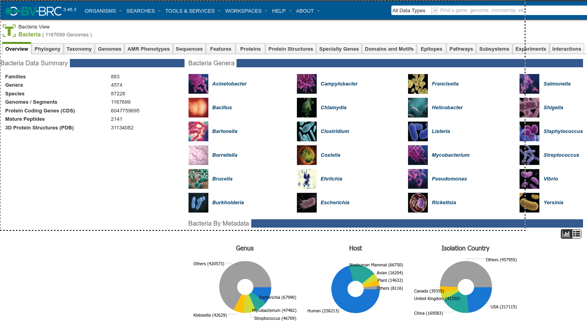
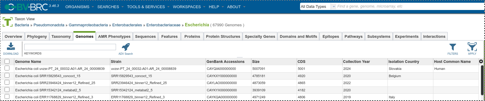
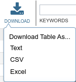
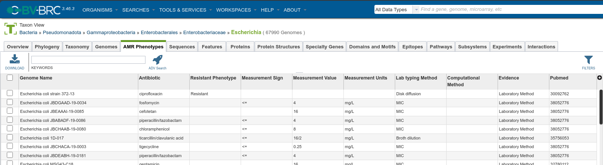

# Build ML model for predict AMR of bacteria by SNP with BV-BRC WGS data (Preprocessing data)

---

## Get the data from the BV-BRC database

1. Clone this repository
2. Access [BV-BRC Bacteria Protal](https://www.bv-brc.org/view/Bacteria/2) 
3. Choose the Bacteria in **Bacteria Genera**
4. Choose **Genomes** Tab then click **Download** then choose **CSV** format
5. Similar with **AMR Phenotypes** Tab 
6. Download you reference fasta from [NCBI](https://www.ncbi.nlm.nih.gov/) and rename it to `sequence.fasta`
7. Create a folder (example: ./workspace) and put the downloaded files (`BVBRC_genome.csv`, `BVBRC_genome_amr.csv`, `sequence.fasta`) in it
8. Start docker image, if folder you created is not `./workspace` you need to change the volume path in the docker command below. You can also build the docker image by yourself or install package like it, see [Dockerfile](Dockerfile). After this command, you will be in the docker container,every command below will be executed in the docker container
    ```bash
    docker run -it --rm -v ./scripts:/home/linuxbrew/scripts -v ./workspace:/home/linuxbrew/workspace ghcr.io/blaplafla13th/bacteria-amr-data-preprocessing:latest
    ```
9. Run this command to index the reference
   ```bash
   bwa-mem2 index sequence.fasta
   ```
10. Edit and run [filter_data.py](scripts/filter_data.py) to filter the data
     ```bash
     python ../scripts/filter_data.py
     ```
11. Edit and run [select_data.py](scripts/select_data.py) to select the data. This script will automatically select minimal amount of sample for your problem
     ```bash
     python ../scripts/select_data.py
     ```
12. Download data from ENA using [ena-downloader](scripts/ena-downloader.sh). You can run it in background
    ```bash
    bash ../scripts/ena-downloader.sh
    ```
13. Edit and run [VariantCalling.nf](scripts/VariantCalling.nf) to call variant. If you run step 10 in background, you can loop this script until the download is finished, it will automatically run new data has been downloaded. You will get `combined.bcf`, `plink.log`, `pairwise.plink.prune.in`, `trimmomatic_total.log' in `./workspace/final` folder for further analysis
    ```bash
    nextflow ../scripts/VariantCalling.nf -resume
    ```
14. Run [final.py](scripts/final.py) to get the final data. You will get `final_data.csv` in `./workspace` folder for training the model
    ```bash
    python ../scripts/final.py
    ```

**If you lazy, do step 1 to 7 then use this command**
```bash
docker run -it --rm -v ./workspace:/home/linuxbrew/workspace ghcr.io/blaplafla13th/bacteria-amr-data-preprocessing:latest ../scripts/all_in_one.sh
```
